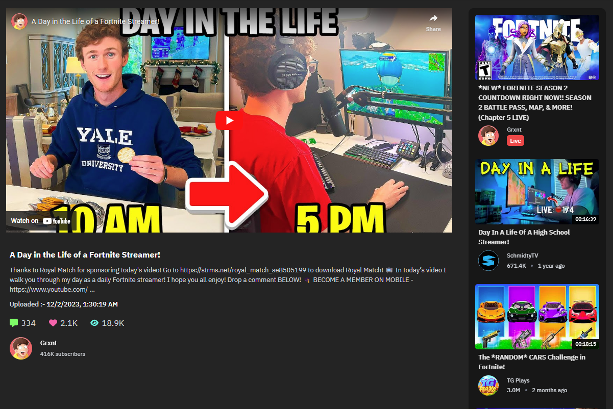

# Youtube Clone in React

## Tech Stack

- Library :- ReactJS
- IDE :- vscode, neovim
- React Icons :- icons
- React Query :- to fetch data
- Typescript :- type checking
- TailwindCSS :- for CSS
- React Top Loading Bar :- for progress bar
- React Router Dom :- for routing

## How to run locally

1. Then clone or fork this repo, run the command `npm install` to install the dependencies, after that run the server using `npm run dev`.
2. Then make an `.env` file declare the variable `VITE_YOUTUBE_KEY` & get your api key from the this site <ins>_[Youtube API](https://rapidapi.com/Glavier/api/youtube138/)_</ins>

### View the live Site here <ins>_[Live Site](https://youtube-clone-react-query-ts.vercel.app)_</ins>

## How UI looks like

### Home Page

### Channel Page

### Video Page

